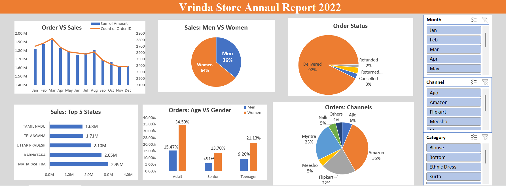

# Vrinda Store Annual Report 2022 Dashboard



## Project Overview

The Vrinda Store Annual Report 2022 Dashboard is an interactive Excel-based business intelligence project designed to analyze sales performance, customer demographics, order status, and sales channels. The dashboard provides a comprehensive overview of business operations and enables data-driven decision-making through dynamic visualizations and filtering options.

Built using Microsoft Excel, the dashboard transforms raw sales data into actionable insights through Pivot Tables, Pivot Charts, Slicers, and Dashboard Design techniques.

---

## Objectives

* Analyze monthly sales and order trends.
* Compare purchasing behavior between men and women.
* Evaluate order fulfillment performance.
* Identify top-performing states by revenue.
* Analyze customer demographics by age and gender.
* Measure the contribution of different sales channels.
* Enable interactive filtering for deeper business analysis.

---

## Dashboard Features

### Order vs Sales Analysis

A combined chart displaying:

* Total Sales Amount
* Total Number of Orders

This visualization helps track monthly business performance and identify peak sales periods throughout the year.

### Sales: Men vs Women

A pie chart illustrating the distribution of sales based on gender.

Key Insight:

* Women contribute 64% of total sales.
* Men contribute 36% of total sales.

---

### Order Status Analysis

Displays the percentage distribution of:

* Delivered Orders
* Cancelled Orders
* Returned Orders
* Refunded Orders

This chart helps assess operational efficiency and customer satisfaction.

---

### Top 5 States by Sales

A horizontal bar chart highlighting the highest revenue-generating states:

* Maharashtra
* Karnataka
* Uttar Pradesh
* Telangana
* Tamil Nadu

This analysis identifies the most profitable geographic markets.

---

### Orders: Age vs Gender

A clustered column chart comparing purchase behavior across age groups:

* Adult
* Teenager
* Senior

The visualization provides insights into customer demographics and target audience segments.

---

### Orders by Sales Channel

A pie chart showing order distribution across various platforms:

* Amazon
* Flipkart
* Myntra
* Ajio
* Meesho
* Nalli
* Others

This helps evaluate the effectiveness of different sales channels.

---

### Interactive Filters

The dashboard includes dynamic slicers for:

#### Month

* January to December

#### Channel

* Amazon
* Ajio
* Flipkart
* Meesho
* Myntra
* Others

#### Category

* Blouse
* Bottom
* Ethnic Dress
* Kurta
* And other product categories

Users can filter the dashboard instantly to perform customized analysis.

---

## Tools and Technologies Used

| Technology             | Purpose               |
| ---------------------- | --------------------- |
| Microsoft Excel        | Dashboard Development |
| Pivot Tables           | Data Aggregation      |
| Pivot Charts           | Data Visualization    |
| Slicers                | Interactive Filtering |
| Excel Functions        | Data Processing       |
| Conditional Formatting | Visual Enhancement    |

---

## Dataset Information

The dataset contains e-commerce sales records including:

* Order ID
* Customer Gender
* Customer Age Group
* Product Category
* Sales Channel
* Order Status
* State
* Sales Amount
* Order Date

---

## Key Business Insights

* Women generated the majority of sales, accounting for 64% of total revenue.
* Maharashtra contributed the highest sales among all states.
* Amazon was the leading sales channel with the highest order share.
* Adult customers represented the largest purchasing segment.
* Most orders were successfully delivered, indicating strong operational performance.
* Monthly sales trends reveal peak and low-performing periods throughout the year.

---

## Skills Demonstrated

* Data Cleaning
* Data Transformation
* Data Analysis
* Dashboard Design
* Business Intelligence Reporting
* Data Visualization
* Pivot Tables
* Pivot Charts
* Interactive Dashboard Development
* Excel Analytics

---

## Project Structure

```text
Vrinda-Store-Annual-Report-2022/
│
├── Vrinda Store Data.xlsx
├── README.md
└── screenshots/
    └── dashboard.png
```

---

## Conclusion

This project demonstrates the use of Microsoft Excel as a business intelligence tool for analyzing retail and e-commerce performance. Through interactive visualizations and dynamic filtering capabilities, the dashboard enables stakeholders to monitor sales trends, understand customer behavior, evaluate channel performance, and make informed business decisions.
